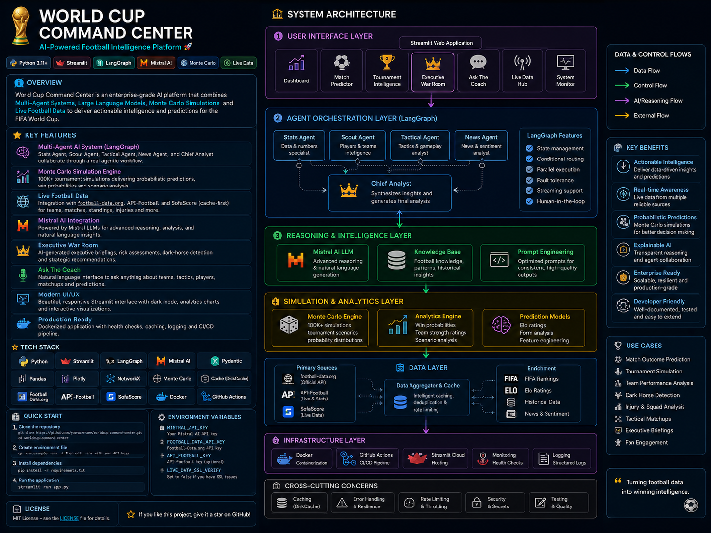

# 🏆 World Cup Intelligence Center 2026 — Final Version

AI-powered football intelligence platform combining predictive analytics, Monte Carlo simulation, real multi-agent orchestration, live-data-ready connectors, Executive War Room briefings and Mistral AI strategic reasoning.

<p align="center">
  
</p>

## What this project demonstrates

This is not just a football prediction app. It is a decision-intelligence architecture applied to the 2026 World Cup use case.

It demonstrates:

- Predictive analytics
- Multi-agent orchestration
- Optional LangGraph execution
- Monte Carlo tournament simulation
- Mistral-powered Chief Analyst
- Ask the Coach strategic reasoning
- Cache-first live data design
- Docker-ready deployment
- CI/CD and testing
- Production readiness diagnostics

- Executive War Room briefing generator
- football-data.org World Cup live snapshot
- Provider-agnostic live data diagnostics

## Core modules

### Match Predictor

Predicts match outcome probabilities using ranking, Elo, squad and form signals.

### Tournament Intelligence

Runs full tournament simulations, including up to 100,000 Monte Carlo runs.

### World Cup Intelligence Center

Runs a real graph-based multi-agent flow:

```text
Stats Agent → Scout Agent → Tactical Agent → Player Agent → News Agent → Debate Agent → Chief Analyst / Mistral
```

The UI exposes the graph trace, execution mode and specialist agent reports.

### Ask the Coach

Answers strategic tournament questions:

- What is Portugal's most likely path to the final?
- Which team is the biggest dark horse?
- What happens if Mbappé misses the quarter-finals?


### Executive War Room

Generates a boardroom-style tournament briefing using live-data diagnostics, Monte Carlo simulation, dark-horse detection, risk register generation and Mistral Chief Analyst reasoning.

This is the recommended module for demos and LinkedIn/Medium storytelling because it shows the full architecture working together.

### Live World Cup Data

Fetches a cache-first World Cup data snapshot using:

- football-data.org World Cup endpoint via `FOOTBALL_DATA_API_KEY`
- API-Football status/health via `API_FOOTBALL_KEY`
- SofaScore local cache enrichment
- Local dataset fallback

### Live Data Operations

Cache-first provider hub supporting:

- API-Football via `API_FOOTBALL_KEY`
- football-data.org via `FOOTBALL_DATA_API_KEY`
- SofaScore cache enrichment
- Local fallback datasets

### Production Readiness

Includes:

- Dockerfile
- docker-compose
- GitHub Actions CI
- tests
- health diagnostics
- environment configuration


## Recommended demo flow

1. Open **Executive War Room** and generate a briefing for Portugal.
2. Open **Tournament Intelligence** and run a 100,000 simulation projection.
3. Open **World Cup Intelligence Center** and show the graph trace.
4. Open **Ask the Coach** and ask: `What happens if Mbappé misses the quarter-finals?`
5. Open **Live World Cup Data** and show provider diagnostics.

This flow demonstrates product thinking, AI architecture, LLM integration, probabilistic simulation and production readiness.

## Tech stack

- Python
- Streamlit
- Pandas
- NumPy
- Scikit-learn
- Plotly
- Mistral AI
- Optional LangGraph
- Docker
- GitHub Actions

## Quick start

```bash
python -m venv .venv
.venv\Scripts\activate
pip install -r requirements.txt
streamlit run app.py
```

## Environment variables

```bash
MISTRAL_API_KEY=your_key
MISTRAL_MODEL=mistral-medium-latest
MISTRAL_TIMEOUT_SECONDS=12
API_FOOTBALL_KEY=optional
FOOTBALL_DATA_API_KEY=optional
LIVE_DATA_TIMEOUT_SECONDS=10
LOG_LEVEL=INFO
```

## Optional LangGraph mode

```bash
pip install -r requirements-agentic.txt
streamlit run app.py
```

If LangGraph is installed, the orchestrator uses it. If not, it falls back to the local state graph executor.

## Docker

```bash
docker compose up --build
```

## Tests

```bash
pip install pytest
pytest -q
```

## Production notes

This project is production-ready in structure, but any real commercial deployment should use licensed sports data providers and validate data rights, API quotas and compliance requirements.

## Author

**Gonçalo Pedro** — AI Tech Lead

Building AI-powered decision systems, multi-agent platforms and intelligent analytics solutions.


## Lastest version Upgrade Worldcup Command Center

The latest version adds a real LangGraph execution path, live data SSL resilience and premium provider diagnostics.

### Real LangGraph mode

Install optional agentic dependencies:

```bash
pip install -r requirements-agentic.txt
```

When LangGraph is available, the app runs a true fan-out/fan-in agent graph:

```text
Stats / Scout / Tactical / Player / News Agents
        ↓
Debate Agent
        ↓
Mistral Chief Analyst
```

The UI displays the active graph mode and node-level execution trace.

### Live data SSL configuration

For normal environments:

```env
LIVE_DATA_SSL_VERIFY=true
```

For local demos behind corporate SSL inspection only:

```env
LIVE_DATA_SSL_VERIFY=false
```

Production recommendation: install the corporate CA certificate and keep SSL verification enabled.
