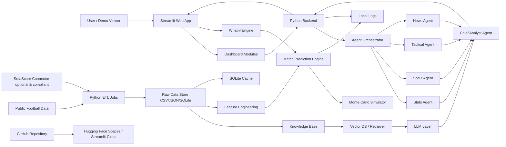

```mermaid
flowchart LR
U[User / Demo Viewer] --> APP[Streamlit Web App]
APP --> DASH[Dashboard Modules]
DASH --> API[Python Backend]
API --> ORCH[Agent Orchestrator]
ORCH --> STATS[Stats Agent]
ORCH --> SCOUT[Scout Agent]
ORCH --> TACTICAL[Tactical Agent]
ORCH --> NEWS[News Agent]
STATS --> CHIEF[Chief Analyst Agent]
SCOUT --> CHIEF
TACTICAL --> CHIEF
NEWS --> CHIEF
CHIEF --> API
API --> APP

PUBLIC[Public Football Data] --> ETL[Python ETL Jobs]
SOFA[SofaScore Connector optional & compliant] --> ETL
ETL --> RAW[Raw Data Store CSV/JSON/SQLite]
RAW --> KB[Knowledge Base]
RAW --> FE[Feature Engineering]
RAW --> CACHE[SQLite Cache]

KB --> VECTOR[Vector DB / Retriever]
VECTOR --> LLM[LLM Layer]
LLM --> CHIEF

FE --> PRED[Match Prediction Engine]
PRED --> MC[Monte Carlo Simulator]
WHATIF[What-if Engine] --> PRED
APP --> WHATIF

GIT[GitHub Repository] --> HOST[Hugging Face Spaces / Streamlit Cloud]
PRED --> LOGS[Local Logs]
API --> LOGS
```
